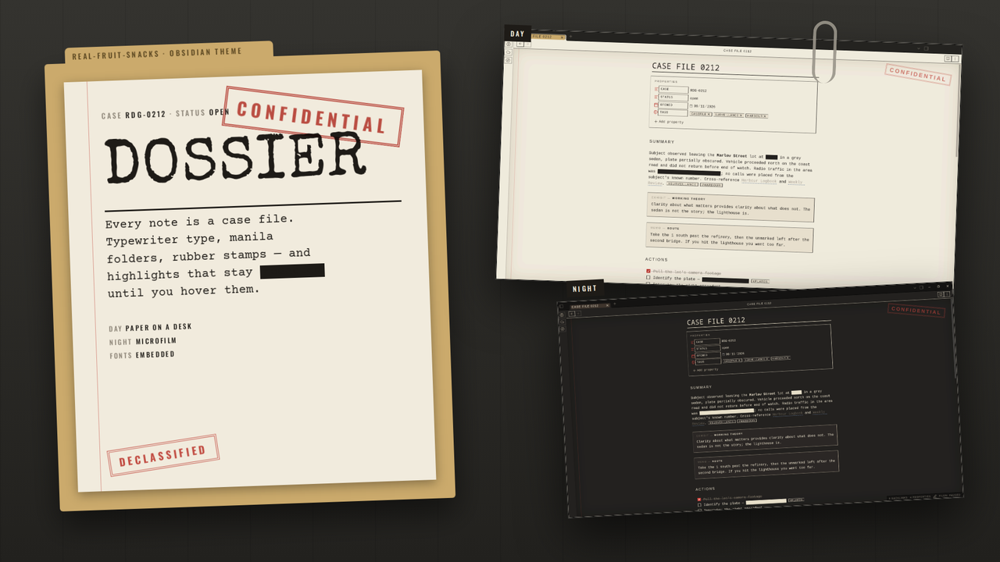
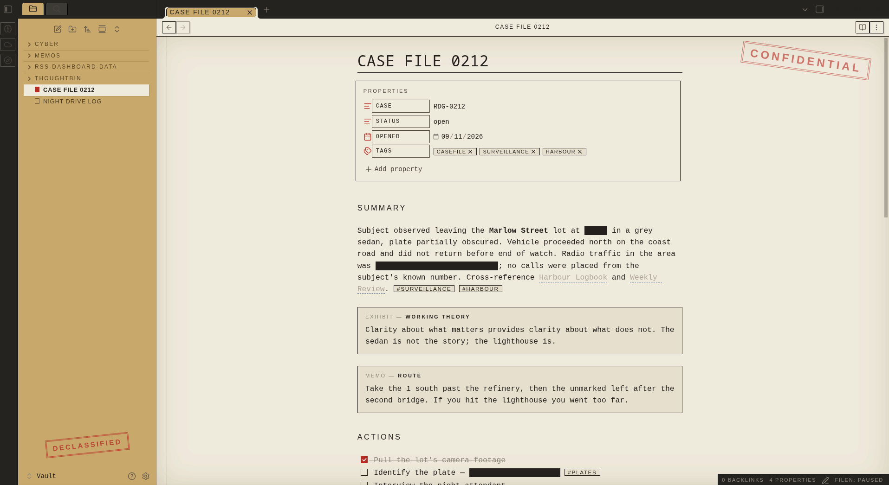
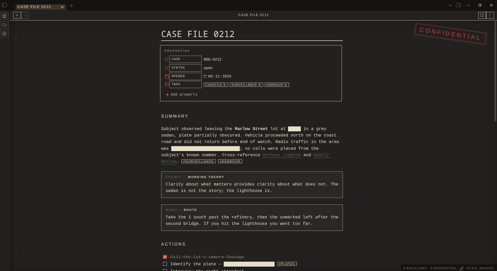

  

# Dossier

Every note is a case file. Manila folders, typewriter type, a red margin, rubber stamps — and one trick: **your highlights are redacted until you hover them.**

Mark a spoiler, an answer, a password, a punchline with `==double equals==` and it stays a black bar until you point at it. It turns highlighting into a reading tool.

## What it does

- Dark desk chrome with manila folder tabs; the file explorer is a folder with a DECLASSIFIED stamp
- Notes are paper with a red margin rule, an inset vignette and a CONFIDENTIAL stamp
- Special Elite titles, Courier Prime body, Oswald `§` section heads — all embedded, nothing to install
- Callouts labelled by type: EXHIBIT, MEMO, NOTICE (with an URGENT sticker), QUERY, STATEMENT, CLOSED
- Dashed "transcript" code blocks, stamped tags, `—` bullets, red-filled checkboxes, dashed-rule menus
- Highlights redacted until hovered; in the editor they reveal on the active line
- Day mode: paper on a desk. Night mode: microfilm — dark paper, cream ink, cream redaction bars

  

  

## Install

**From the community list** — Settings → Appearance → Themes → Manage → search "Dossier".

**Manually**

1. Download `theme.css` and `manifest.json` from the [latest release](https://github.com/Real-Fruit-Snacks/obsidian-dossier/releases/latest).
2. Put them in `<your vault>/.obsidian/themes/Dossier/`.
3. Settings → Appearance → Themes → Dossier.

Readable line length on is recommended — the stamp and margin sit in the space around a centred page.

## Palette

| Role | Day | Night |
|---|---|---|
| Paper | `#F1EBDD` | `#1E1C19` |
| Folder | `#CBAA6C` | `#3B3128` |
| Ink | `#1E1B17` | `#E8DFCB` |
| Red | `#B7281F` | `#D9433A` |
| Blue | `#1F3F73` | `#86A9DC` |
| Reveal | `#F6E27A` | `#B89E3A` |

## Contributing

Issues and pull requests welcome. No build step: edit `theme.css`, reload Obsidian. For development the fonts can be split into a CSS snippet — see `dev/`.

## License

MIT. Fonts are under the SIL Open Font License.
